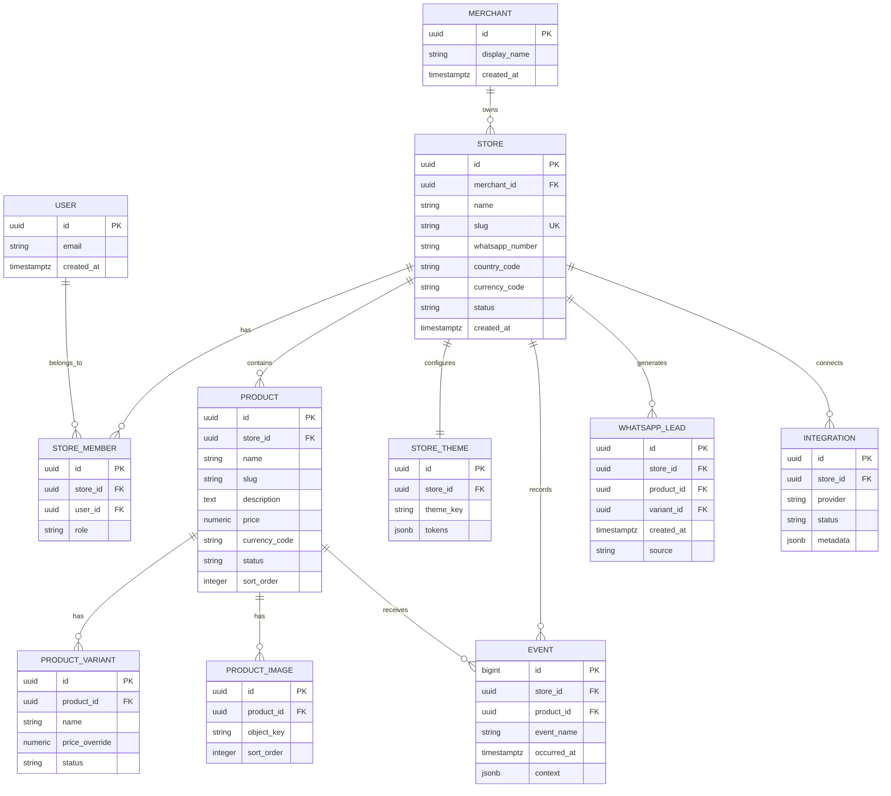

# ADR-001 — MVP platform architecture

Status: Accepted  
Date: 2026-10-07  
Scope: Commerce Factory MVP

## Context

Commerce Factory is a multi-tenant SaaS for merchants who already sell through WhatsApp, Instagram or Facebook. The MVP must let a merchant create a branded storefront, add products, publish it and hand a customer into WhatsApp with a prefilled order message.

The architecture should optimize for:
- low initial operating cost;
- fast product iteration;
- strong tenant isolation;
- mobile-first storefront performance;
- a credible path to Meta integrations and custom domains;
- portability where it matters;
- as few moving parts as possible before product-market validation.

It should not optimize for hypothetical enterprise scale before we have merchant evidence.

## Decision summary

### Recommended for MVP

- **Web application:** React 19 + TypeScript + Vite.
- **Hosting:** Cloudflare Pages.
- **API boundary:** Cloudflare Worker + Hono.
- **Primary database:** Neon PostgreSQL.
- **Database access:** server-side only from the Worker; no privileged database credentials in the browser.
- **Authentication:** Neon Auth is the preferred integrated option once the Commerce Factory Neon project is provisioned; the domain model stores the external auth subject rather than coupling core tables to provider-owned user tables.
- **Product/store media:** Cloudflare R2 for product images.
- **Analytics:** first-party event tables in Neon for merchant-facing metrics; PostHog may be added for product analytics but is not the merchant reporting source of truth.
- **Storefront model:** one multi-tenant application, not one deployment per merchant.
- **Public URLs:** `/shop/:storeSlug` and `/shop/:storeSlug/p/:productSlug` for MVP. Custom domains are deferred.

This keeps Postgres portable while using Cloudflare for the application edge and Neon for relational state.

## Options considered

### Option A — Cloudflare-first

React/Vite + Cloudflare Pages + Worker/Hono + D1 + R2.

**Possible:** yes.  
**Common:** increasingly common for edge-first products.  
**Strengths:** low infrastructure overhead, integrated platform, cheap at low traffic, excellent global delivery.  
**Weaknesses:** D1 adds SQLite-specific constraints and deeper Cloudflare coupling to the core relational model. Multi-tenant relational behavior is viable, but migrating later is more work than starting on Postgres.

**Verdict:** credible alternative, especially if operating cost becomes the dominant constraint.

### Option B — portable Postgres service

React/Vite + Cloudflare Worker/Hono + Neon PostgreSQL + R2.

**Possible:** yes.  
**Common:** common for modern serverless SaaS.  
**Strengths:** standard Postgres semantics, clean API trust boundary, strong portability, excellent fit for integrations/background jobs, no browser database credential.  
**Weaknesses:** adds an API runtime from day one and requires explicit authentication/authorization wiring.

**Verdict:** **recommended for this MVP** because the user chose Neon and the architecture remains portable and operationally small.

### Option C — integrated BaaS

React/Vite + Supabase Postgres/Auth/Storage.

**Possible:** yes.  
**Common:** common for MVP SaaS products.  
**Strengths:** tightly integrated auth/database/storage.  
**Weaknesses:** not selected; it would duplicate platform capabilities once Neon is the database choice.

**Verdict:** rejected for Commerce Factory after the database decision moved to Neon.

## Key architectural rule: do not deploy one app per merchant

A merchant storefront is data plus theme configuration rendered by the shared application.

Creating a store must create database records, not a new repository, Vercel project or Cloudflare Pages project.

Why:
- avoids deployment explosion;
- makes fixes instant for every merchant;
- keeps analytics and security centralized;
- simplifies custom domains later;
- allows theme evolution without rebuilding hundreds of stores.

The term “Factory” describes the product experience, not the infrastructure topology.

## Application boundaries

### Marketing
Routes such as:
- `/`
- `/pricing`
- `/demo`

No merchant-private logic should be imported here.

### Merchant application
Routes such as:
- `/app`
- `/app/products`
- `/app/store`
- `/app/analytics`

Authentication required.

### Public storefront
Routes:
- `/shop/:storeSlug`
- `/shop/:storeSlug/p/:productSlug`

Only published/active data can be returned.

### API / server boundary

The Cloudflare Worker/Hono API owns all privileged data access.

Responsibilities:
- validate authentication;
- resolve the authenticated subject;
- enforce store membership before every tenant-scoped read/write;
- execute Neon queries with server-only credentials;
- ingest abuse-sensitive analytics events;
- handle Meta OAuth/token exchange and webhooks;
- sign or proxy object-storage operations where required.

The browser receives only the public API URL. It never receives the Neon connection string.

## Domain model

## Tenant boundary

The security boundary is **store membership + store_id**.

Rules:
1. every tenant-owned record must resolve to exactly one `store_id`;
2. authenticated merchant queries must be restricted to stores where the user has membership;
3. public reads must use dedicated policies/views that expose only published fields;
4. client-supplied `store_id` is never trusted as authorization;
5. cross-tenant negative tests are mandatory;
6. storage object keys must be namespaced by store.

Suggested media key:
`stores/{storeId}/products/{productId}/{imageId}.webp`

## Authentication

Preferred direction: Neon Auth once the dedicated Commerce Factory Neon project exists.

Core tenant tables remain auth-provider-neutral by storing an `auth_subject` string in `store_members`. This avoids foreign keys into provider-owned auth schemas and keeps the domain portable.

MVP can start with owner role only. Do not build a complex RBAC matrix before there is a real requirement.

## Storefront data strategy

The public storefront queries published store/product data by slug.

MVP should prefer runtime data loading over generating static builds per merchant.

Later optimization paths:
- CDN caching;
- route-level pre-rendering;
- edge cache invalidation;
- custom-domain routing.

These are performance optimizations, not MVP requirements.

## WhatsApp handoff

The customer journey is:

`product_view → whatsapp_order_click → WhatsApp`

The product records the click/lead **before** opening WhatsApp.

A WhatsApp click is not called an order or sale. Completed sales remain merchant-confirmed until a stronger attribution mechanism exists.

## Analytics

Merchant-facing MVP metrics:
- storefront views;
- product views;
- WhatsApp CTA clicks;
- top products;
- click-through rate.

No phone number, message body or other unnecessary PII should be stored in event payloads.

## Media

Cloudflare R2 is recommended for product/store media.

Constraints:
- validate MIME and file size;
- optimize images before serving them on storefronts;
- store generated object keys, not arbitrary external URLs as canonical media;
- namespace objects by store;
- document deletion/orphan cleanup.

Suggested key: `stores/{storeId}/products/{productId}/{imageId}.webp`.

## Meta integration

Meta is an adapter, not a core dependency.

The `Integration` boundary must support:
- provider state;
- OAuth metadata;
- token references/secrets stored server-side;
- catalog sync cursor/state;
- webhook state.

Automated ad creation remains post-MVP.

## Custom domains

Not an MVP blocker.

Initial stores use platform paths/subdomains. Later custom-domain support should be implemented centrally, not by creating merchant-specific deployments.

Cloudflare for SaaS or an equivalent managed custom-hostname product can be evaluated when paying merchants require it.

## Migration strategy

1. Keep SQL migrations committed under `db/migrations`.
2. Never make production schema changes manually without a migration.
3. Use additive migrations where possible.
4. Keep product/domain code independent of Neon-specific control-plane APIs.
5. Test schema changes on a Neon branch before applying them to the production branch.
6. Treat authentication and object storage as separate migration concerns from relational data.

## Cost posture

MVP should stay inside free/low-cost tiers while traffic is small.

Cost is reviewed before adding:
- background jobs;
- image transforms at scale;
- custom domains;
- high-volume analytics;
- Meta sync workers.

Free tier is a launch constraint, not a permanent architecture promise.

## Revisit triggers

Revisit this ADR when one of these becomes true:
- storage/egress cost becomes material;
- RLS complexity blocks development speed;
- background jobs become central;
- merchant count requires dedicated caching;
- custom domains become a paid core feature;
- Meta synchronization becomes high-volume;
- regulatory/customer requirements demand stricter infrastructure isolation.
